# Zabbix 的 DCE 解决方案

## 解决方案介绍

容器具有隔离性，传统的运维监控方法不再合适于容器的监控。同时容器的生命周期短，容器部署会遵循集群调度规则，因此部署的节点不固定，监控要有发现机制。

Zabbix 作为主流的监控系统仍然在大部分的企业中使用，使用 Zabbix 监控容器不同于主机监控，需要具备容器数据的采集能力与容器发现机制。此解决方案主要提供了 Zabbix 的容器化部署方式与容器监控配置方法，解决了容器监控难的问题。

## 安装

### 部署 Zabbix Server

DCE 的「镜像仓库」提供了 Zabbix Server 的官方镜像，如果已经部署好 Zabbix Server，可跳过这步。

1.  在「应用」中选择「创建」，选择用「镜像仓库」的方式来创建应用。

    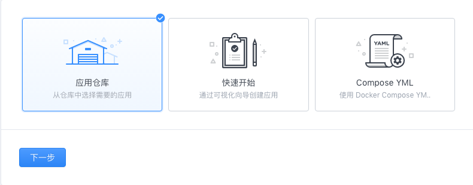
2.  选择 zabbix-server 应用。

    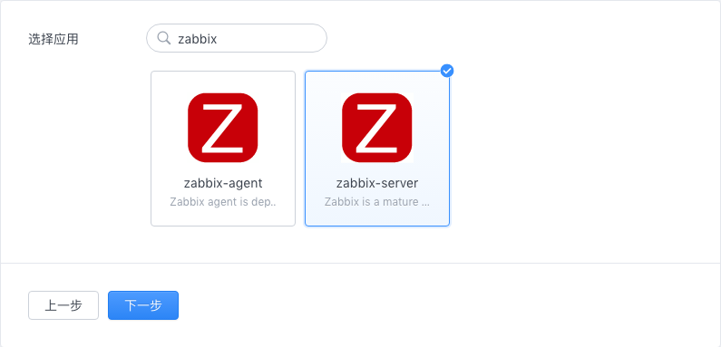
3. 输入 zabbix 所使用的数据库用户。

    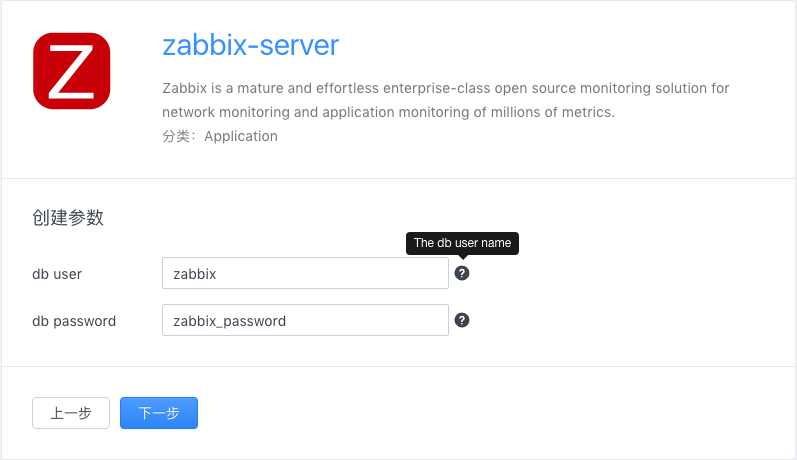
4. 输入「应用名称」，如果需要固定访问端口，可以修改「Compose YML」 的 ports 字段。

    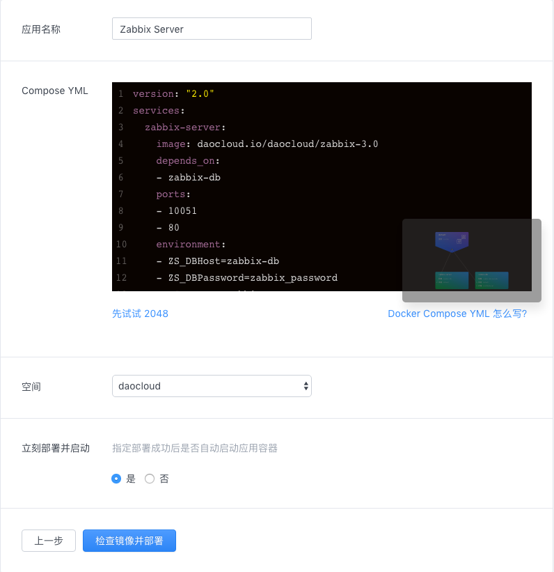

5. 创建好应用后在「概览」标签下可以看到 Zabbix 的访问地址。

    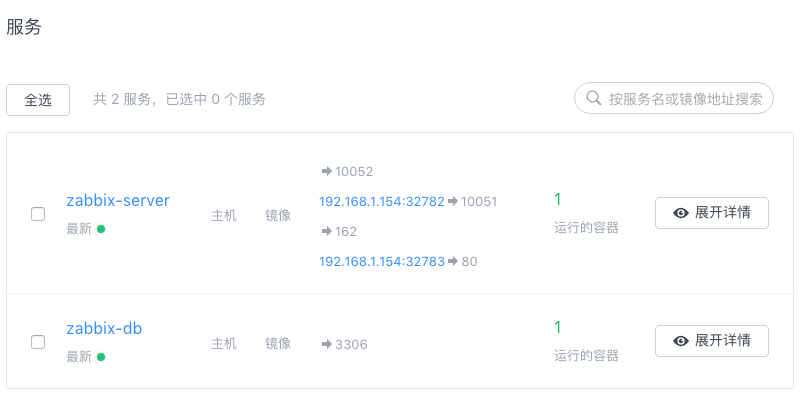

6. 使用管理员用户登录，默认管理员账号 Admin / zabbix。

    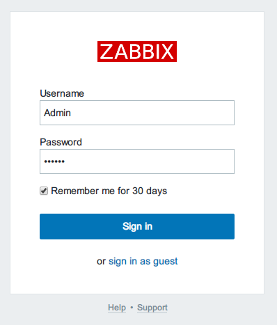

    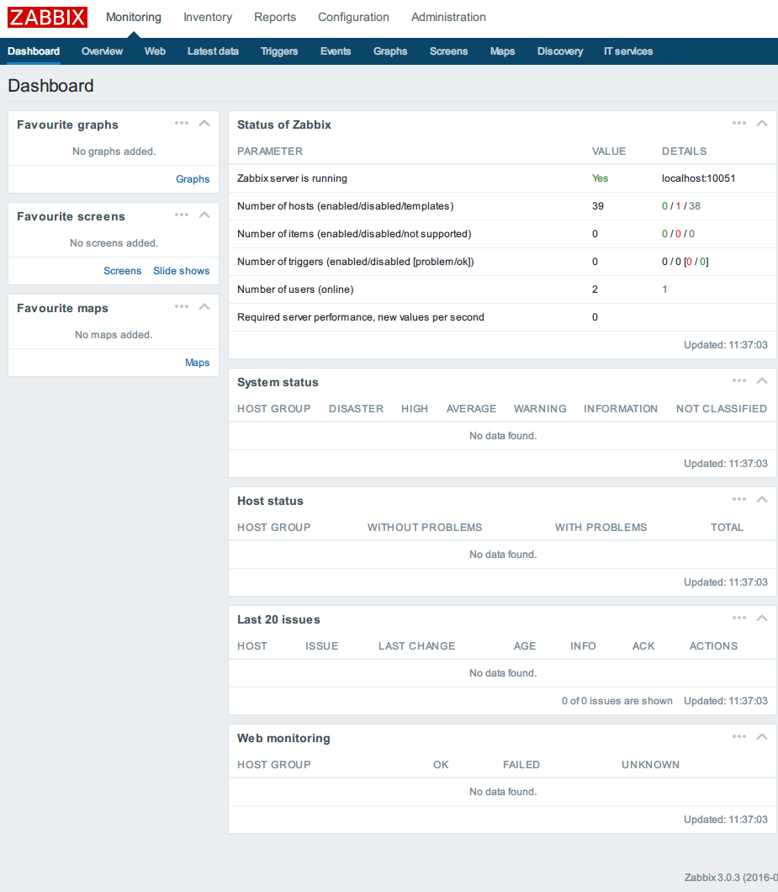

### 部署 Zabbix Agent

Zabbix Agent 采用开源的第三方镜像 [monitoringartist/zabbix-docker-monitoring](https://hub.docker.com/r/monitoringartist/zabbix-agent-xxl-limited/)。

1. 在「应用」中选择「创建」，选择用「镜像仓库」的方式来创建应用。

2. 选择 zabbix-agent 应用。

    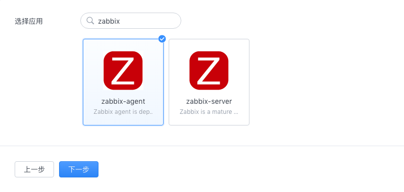
3. 填写主机名和 Zabbix Server 的 IP 地址

    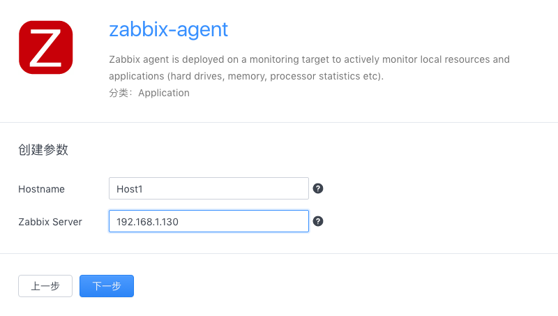
4. 点击检查镜像并部署

    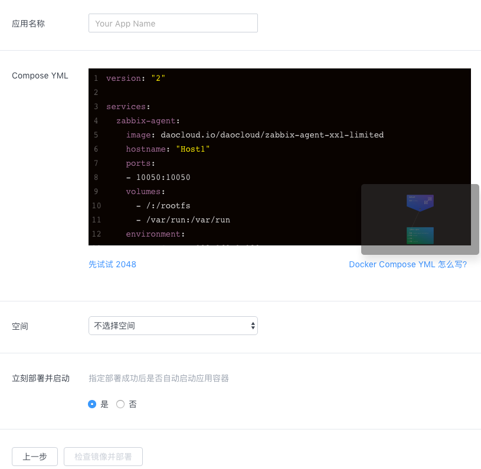

## 使用

### 配置 Zabbix Server

1. 在本地克隆 [monitoringartist/zabbix-docker-monitoring](https://github.com/monitoringartist/zabbix-docker-monitoring) 代码仓库，在 Zabbix 中导入 template/Zabbix-Template-App-Docker.xml 模板文件。

    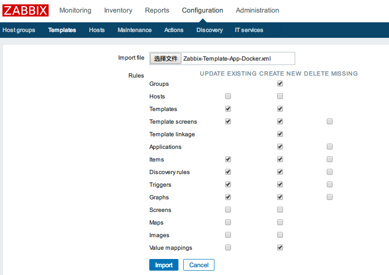
2. 添加主机发现规则，配置 IP range、Checks、，key 填写 `system.hostname`。Device uniqueness criteria 选择 `Zabbix agent "system.hostname"`。

    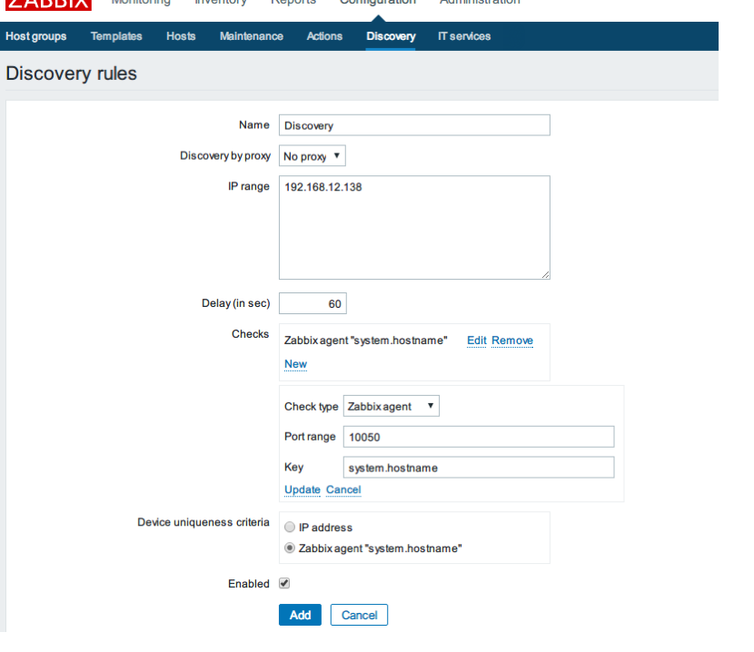
3. 添加发现动作，条件与操作配置如图所示。

    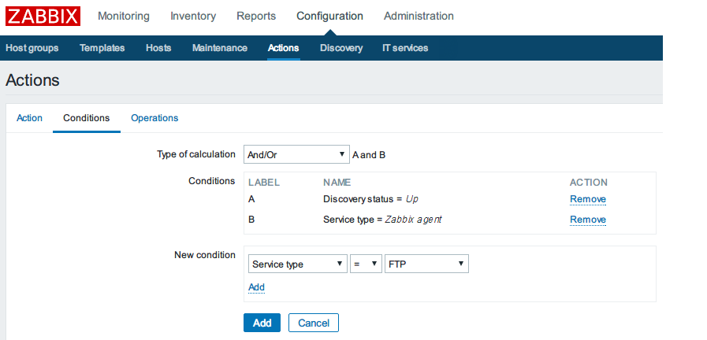

    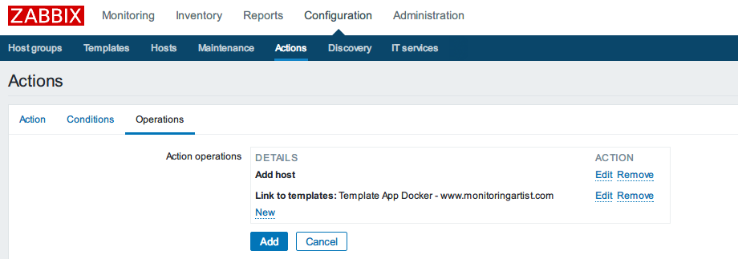
4. 等待主机被发现后，可以在主机列表找到自动添加的主机，同时自动关联了模板。

    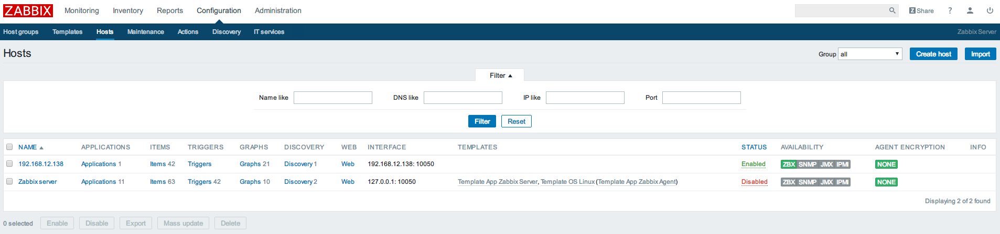
5. 在总览列表可以看到该主机上所有的容器监控数据。

    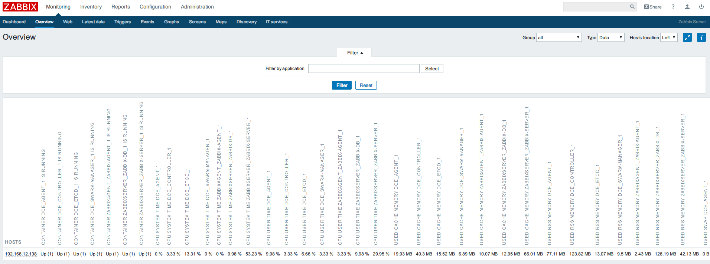

参考:

* [Zabbix 集成 Docker](https://www.zabbix.org/wiki/Dockerized_Zabbix)